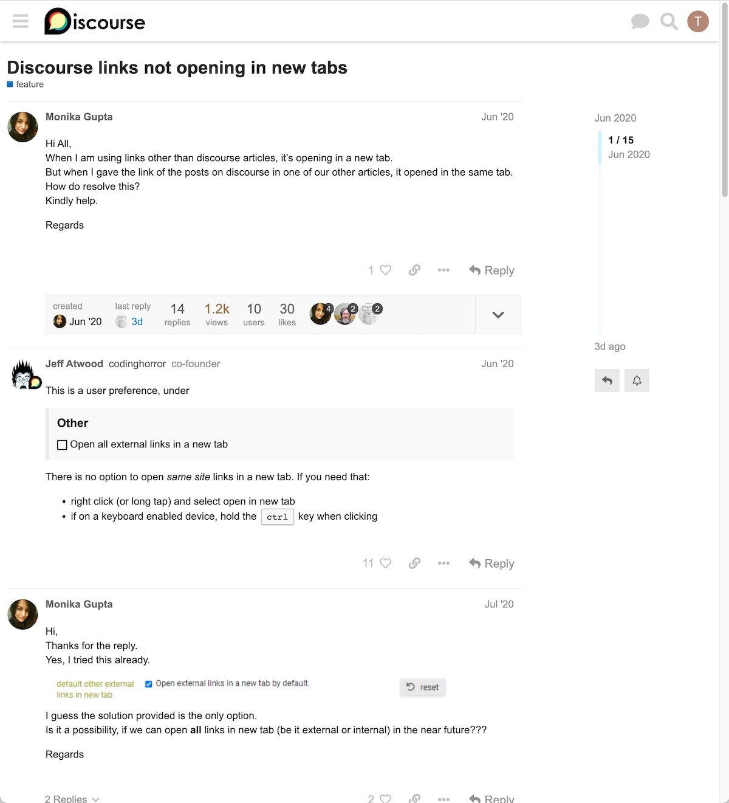
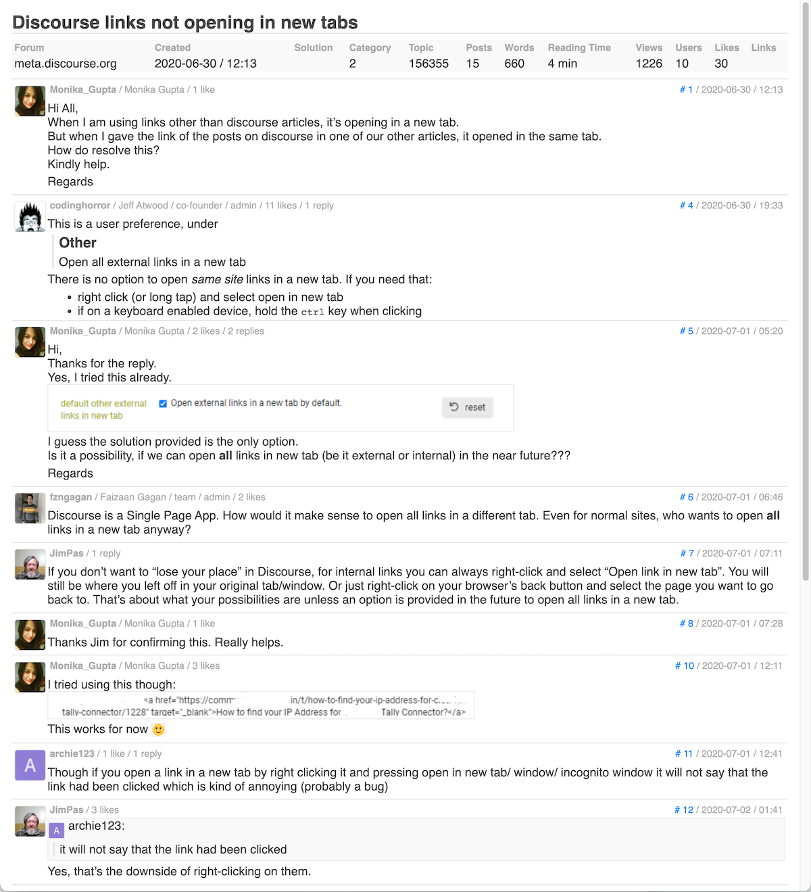

# discourse-compact-topic-view

### Purpose
Compact view of topics.

### Description
To get an overview of a topic, a compact view of all posts can be helpful.

Standard GUI:

Compact GUI:

### How-to
If the source data (posts) are available, there is a lot of freedom to transform the data.

Procedure:
* Load discourse data on local computer (via discourse-reader).
* Transform discourse data (via Go templates and dagote).
* Display the transformed data in the browser.

Concept:
* Via Go template you define what should be displayed.
* Via CSS you define how something is displayed.

Ideally, the process steps are executed automatically via a script. The compact display shown above was achieved with 150 lines of template and CSS code each. JavaScript was omitted, but this leads to minor limitations.

### Sources
* batch, template, css: see this repository
* discourse-reader : https://github.com/Klaus-Tockloth/discourse-reader
* dagote : https://github.com/Klaus-Tockloth/dagote
* discource-user-api-key : https://github.com/Klaus-Tockloth/discourse-user-api-key
